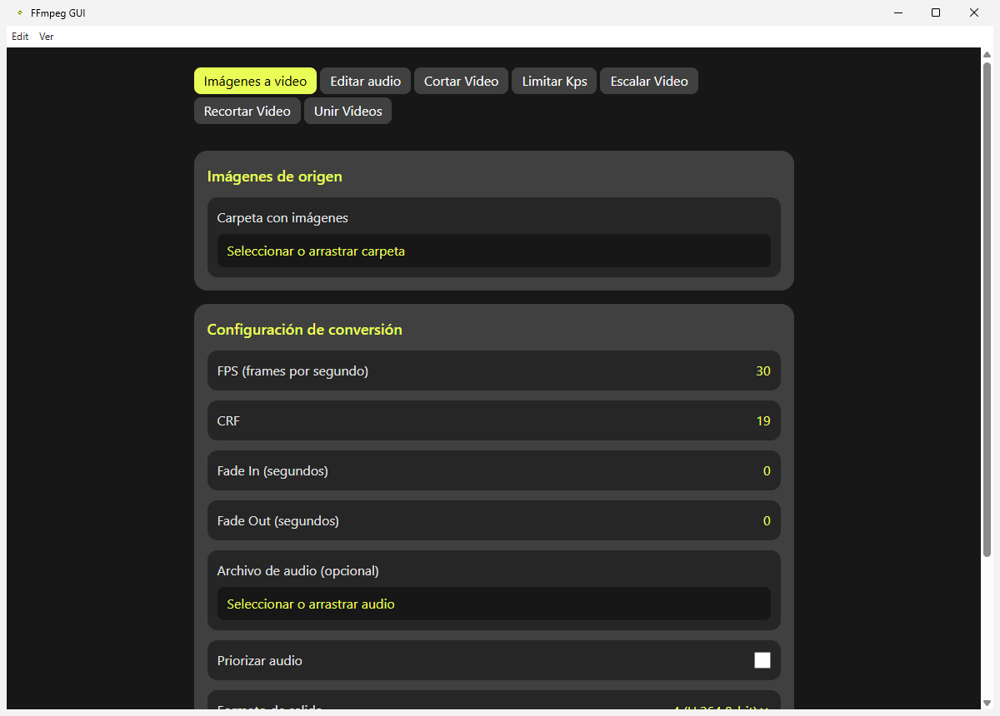
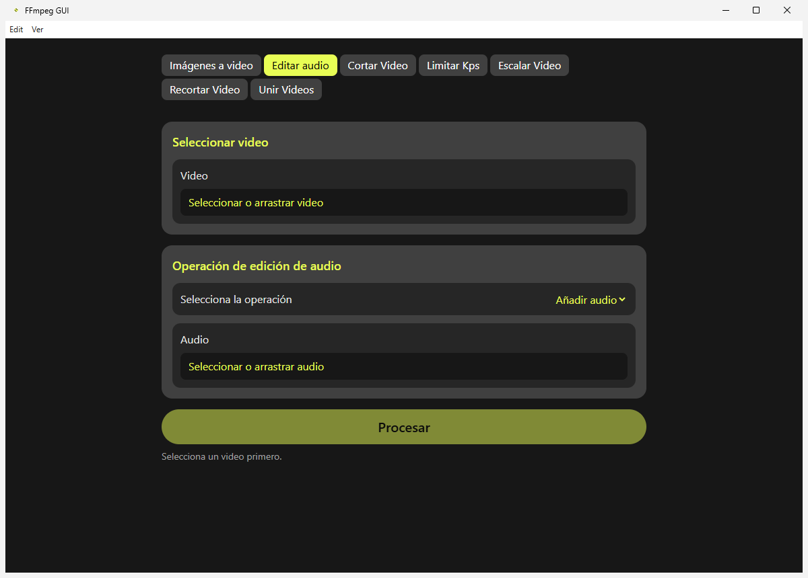
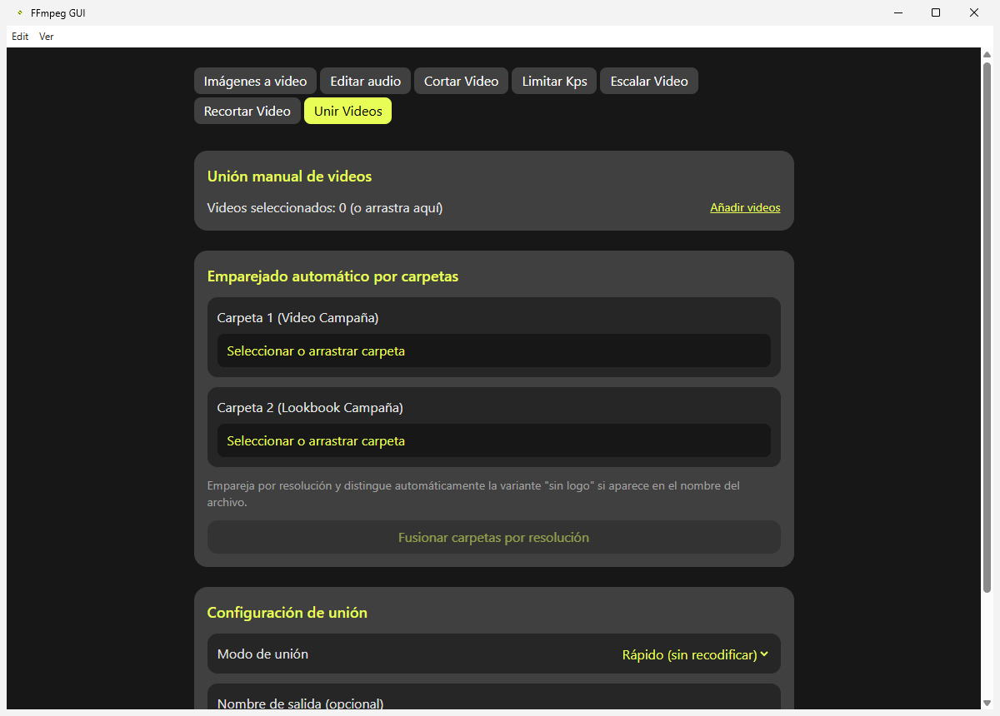

# FFmpeg GUI — Frontend (Electron + React)

Interfaz de escritorio alternativa para el backend de `ffmpeg-gui`, construida con Electron, React, TypeScript, Vite y Tailwind CSS.



Siete pestañas con la misma cobertura de funciones que la GUI PyQt6 original: **Imágenes a video**, **Editar audio**, **Cortar Video**, **Limitar Kps**, **Escalar Video**, **Recortar Video** y **Unir Videos** (manual o emparejado automático por carpetas — esta última no existía en el scaffold original). Todas las pestañas soportan drag & drop de archivos/carpetas, muestran una cola de tareas con progreso y cancelación, y deshabilitan el envío hasta que los campos obligatorios están completos.

| Editar audio | Unir videos |
|---|---|
|  |  |

## Cómo se conecta con el backend

Esta aplicación no reimplementa la lógica de FFmpeg: llama al backend Python que vive en `../logic/`.

- `../logic/ffmpeg_logic.py` construye los comandos de FFmpeg (sin dependencias de PyQt, reutilizado también por la GUI de escritorio en `../gui/`).
- `../logic/cli.py` es un puente headless: lee una petición JSON por `stdin`, ejecuta el comando FFmpeg correspondiente y va emitiendo progreso/resultado como líneas JSON por `stdout`. No depende de PyQt.
- El proceso principal de Electron (`electron/main.ts`) reenvía el progreso al renderer por IPC (`operation:message`) y expone selectores de archivo/carpeta nativos.
- El renderer (`src/`) usa `window.api` (definido en `electron/preload.ts`) para lanzar operaciones, escuchar progreso y cancelar tareas — ver `src/hooks/useTaskQueue.ts`.

En **desarrollo** (`npm run dev`), Electron ejecuta `python logic/cli.py` directamente, así que necesitas `python` en el `PATH`. En un **build empaquetado** (`npm run build`), en su lugar se usa un ejecutable independiente (ver más abajo) que ya lleva Python embebido — el usuario final no necesita instalarlo.

En ambos casos hace falta `ffmpeg` y `ffprobe` accesibles en el `PATH` del sistema (no se empaquetan). Si faltan, la aplicación lo detecta al arrancar y muestra un aviso en la interfaz en vez de fallar en silencio en cada conversión.

## Pruebas

```bash
npm run test:backend
```

Ejecuta `../tests/test_cli_bridge.cjs`: genera sus propios ficheros de prueba con `ffmpeg` en una carpeta temporal (nada se commitea al repo), ejercita las 14 operaciones del puente (incluyendo cancelación y una operación desconocida) por el mismo mecanismo de `spawn` que usa `electron/main.ts`, y limpia todo al terminar.

## Desarrollo

```bash
npm install
npm run dev
```

## Compilación / instalador distribuible

```bash
npm run build
```

Esto hace, en orden:

1. `tsc` — comprueba tipos.
2. `build:backend` (`scripts/build-backend.cjs`) — empaqueta `../logic/cli.py` como `backend-dist/ffmpeg-cli-bridge.exe` usando PyInstaller, sin dependencias de Python en la máquina de destino. Requiere un intérprete de Python con PyInstaller instalado en la máquina donde se **construye** (usa `../venv` si existe, o busca `python`/`python3`/`py` en el `PATH`; instala PyInstaller con `pip install -r ../requirements.txt`).
3. `vite build` — compila el renderer y el proceso main/preload.
4. `electron-builder` — empaqueta todo (incluyendo `backend-dist/ffmpeg-cli-bridge.exe` como `resources/logic/ffmpeg-cli-bridge.exe`, vía `extraResources` en `electron-builder.json5`) en un instalador NSIS en `release/<version>/`.

El resultado es un `.exe` que **no requiere Python instalado en la máquina del usuario** — solo `ffmpeg`/`ffprobe` en el `PATH`, igual que la GUI PyQt6 original.

> Nota (Windows sin modo desarrollador): si `electron-builder` falla al descargar `winCodeSign` con un error de "no se puede crear el enlace simbólico", es porque esa dependencia incluye símlinks de macOS que Windows no puede extraer sin privilegios de administrador o el Modo de Desarrollador activado (Configuración → Privacidad y seguridad → Para desarrolladores). Solo afecta la primera descarga; una vez está en caché (`%LOCALAPPDATA%\electron-builder\Cache`) no vuelve a ocurrir.
